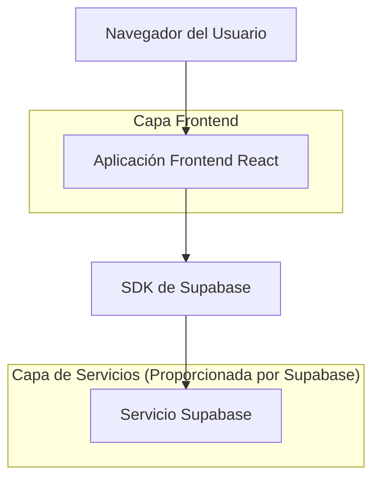
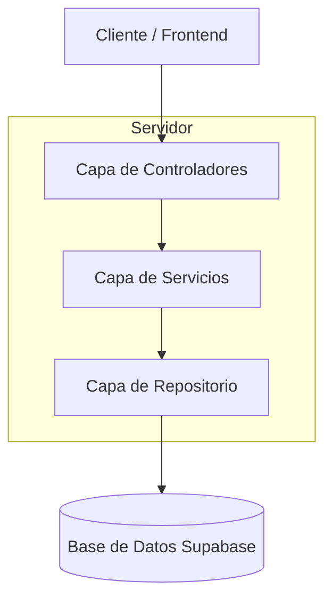
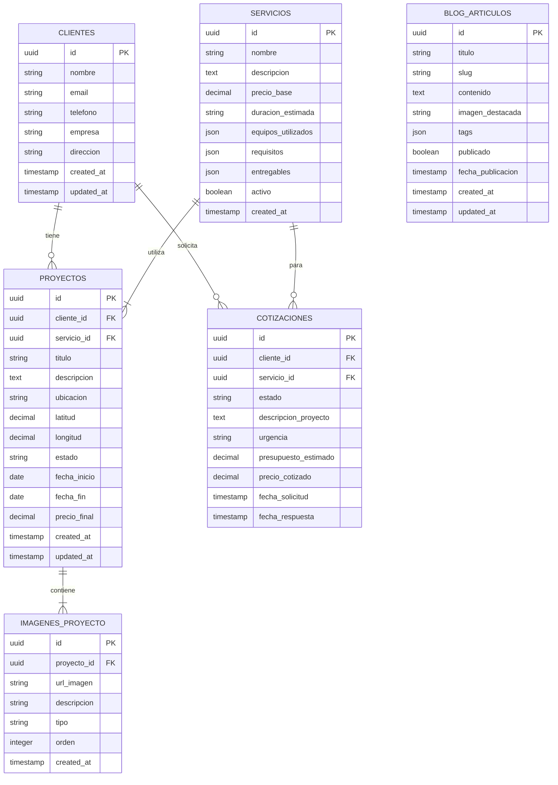

# Documento de Arquitectura Técnica - Topografía PECVA

## 1. Diseño de Arquitectura



## 2. Descripción de Tecnologías

- **Frontend**: React@19 + Next.js@15.2.4 + TailwindCSS@3.4.17 + TypeScript@5
- **Backend**: Supabase (PostgreSQL + Auth + Storage)
- **UI Components**: Radix UI + Framer Motion para animaciones
- **Gestión de Estado**: React Hooks + Context API
- **SEO**: Next.js App Router + next-sitemap

## 3. Definiciones de Rutas

| Ruta | Propósito |
|------|----------|
| / | Página de inicio con hero section y servicios destacados |
| /servicios | Catálogo completo de servicios topográficos |
| /servicios/[slug] | Detalle específico de cada servicio ofrecido |
| /proyectos | Galería de proyectos realizados con filtros |
| /proyectos/[id] | Detalle completo de proyecto individual |
| /sobre-nosotros | Información de la empresa, equipo y certificaciones |
| /blog | Lista de artículos técnicos de topografía |
| /blog/[slug] | Artículo individual del blog técnico |
| /contacto | Formulario de contacto y información de ubicación |
| /cotizacion | Formulario especializado para solicitar cotizaciones |
| /area-cliente | Dashboard para clientes registrados (requiere auth) |
| /area-cliente/proyectos | Proyectos del cliente con estado y documentos |
| /area-cliente/informes | Descarga de informes y documentos técnicos |
| /login | Página de autenticación para clientes |
| /registro | Registro de nuevos clientes |

## 4. Definiciones de API

### 4.1 API Principal

**Gestión de Proyectos**
```
GET /api/proyectos
```

Respuesta:
| Nombre Parámetro | Tipo Parámetro | Descripción |
|------------------|----------------|-------------|
| id | string | Identificador único del proyecto |
| titulo | string | Nombre del proyecto |
| descripcion | string | Descripción técnica del proyecto |
| tipo_servicio | string | Tipo de servicio topográfico |
| ubicacion | string | Ubicación geográfica del proyecto |
| fecha_inicio | date | Fecha de inicio del proyecto |
| fecha_fin | date | Fecha de finalización |
| estado | string | Estado actual (en_proceso, completado, pendiente) |
| imagenes | array | URLs de imágenes del proyecto |
| cliente_id | string | ID del cliente propietario |

**Solicitud de Cotización**
```
POST /api/cotizaciones
```

Request:
| Nombre Parámetro | Tipo Parámetro | Requerido | Descripción |
|------------------|----------------|-----------|-------------|
| nombre | string | true | Nombre del solicitante |
| email | string | true | Email de contacto |
| telefono | string | true | Teléfono de contacto |
| tipo_servicio | string | true | Tipo de servicio requerido |
| ubicacion | string | true | Ubicación del proyecto |
| descripcion | string | true | Descripción detallada del requerimiento |
| urgencia | string | false | Nivel de urgencia (baja, media, alta) |
| presupuesto_estimado | number | false | Presupuesto aproximado disponible |

Ejemplo:
```json
{
  "nombre": "Juan Pérez",
  "email": "juan@ejemplo.com",
  "telefono": "+34 600 123 456",
  "tipo_servicio": "topografia_urbana",
  "ubicacion": "Madrid, España",
  "descripcion": "Levantamiento topográfico para construcción de vivienda unifamiliar",
  "urgencia": "media"
}
```

**Gestión de Servicios**
```
GET /api/servicios
```

Respuesta:
| Nombre Parámetro | Tipo Parámetro | Descripción |
|------------------|----------------|-------------|
| id | string | Identificador del servicio |
| nombre | string | Nombre del servicio |
| descripcion | string | Descripción técnica completa |
| precio_base | number | Precio base del servicio |
| duracion_estimada | string | Tiempo estimado de ejecución |
| equipos_utilizados | array | Lista de equipos técnicos |
| requisitos | array | Requisitos previos del cliente |
| entregables | array | Documentos y productos finales |

## 5. Arquitectura del Servidor



## 6. Modelo de Datos

### 6.1 Definición del Modelo de Datos



### 6.2 Lenguaje de Definición de Datos

**Tabla de Clientes**
```sql
-- Crear tabla clientes
CREATE TABLE clientes (
    id UUID PRIMARY KEY DEFAULT gen_random_uuid(),
    nombre VARCHAR(100) NOT NULL,
    email VARCHAR(255) UNIQUE NOT NULL,
    telefono VARCHAR(20),
    empresa VARCHAR(100),
    direccion TEXT,
    created_at TIMESTAMP WITH TIME ZONE DEFAULT NOW(),
    updated_at TIMESTAMP WITH TIME ZONE DEFAULT NOW()
);

-- Crear índices
CREATE INDEX idx_clientes_email ON clientes(email);
CREATE INDEX idx_clientes_created_at ON clientes(created_at DESC);

-- Permisos Supabase
GRANT SELECT ON clientes TO anon;
GRANT ALL PRIVILEGES ON clientes TO authenticated;
```

**Tabla de Servicios**
```sql
-- Crear tabla servicios
CREATE TABLE servicios (
    id UUID PRIMARY KEY DEFAULT gen_random_uuid(),
    nombre VARCHAR(100) NOT NULL,
    descripcion TEXT NOT NULL,
    precio_base DECIMAL(10,2),
    duracion_estimada VARCHAR(50),
    equipos_utilizados JSON,
    requisitos JSON,
    entregables JSON,
    activo BOOLEAN DEFAULT true,
    created_at TIMESTAMP WITH TIME ZONE DEFAULT NOW()
);

-- Crear índices
CREATE INDEX idx_servicios_activo ON servicios(activo);
CREATE INDEX idx_servicios_nombre ON servicios(nombre);

-- Datos iniciales
INSERT INTO servicios (nombre, descripcion, precio_base, duracion_estimada, equipos_utilizados, requisitos, entregables) VALUES
('Topografía Urbana', 'Levantamiento topográfico completo para zonas urbanas y periurbanas', 1500.00, '5-7 días', '["Estación Total", "GPS RTK", "Nivel Digital"]', '["Acceso al terreno", "Documentación catastral"]', '["Plano topográfico", "Memoria técnica", "Coordenadas GPS"]'),
('Batimetría', 'Medición de profundidades en cuerpos de agua', 2500.00, '3-5 días', '["Ecosonda", "GPS Diferencial", "Embarcación"]', '["Acceso al agua", "Permisos navegación"]', '["Plano batimétrico", "Modelo 3D fondo", "Informe técnico"]'),
('Fotogrametría Aérea', 'Levantamiento mediante drones y procesamiento fotogramétrico', 2000.00, '7-10 días', '["Dron profesional", "Cámara métrica", "Software especializado"]', '["Permisos vuelo", "Condiciones meteorológicas"]', '["Ortofoto", "Modelo digital terreno", "Nube de puntos"]'),
('Replanteo de Obra', 'Materialización en terreno de elementos proyectados', 800.00, '2-3 días', '["Estación Total", "Prismas", "Estacas topográficas"]', '["Proyecto ejecutivo", "Acceso obra"]', '["Acta replanteo", "Coordenadas puntos", "Fotografías"]');

-- Permisos Supabase
GRANT SELECT ON servicios TO anon;
GRANT ALL PRIVILEGES ON servicios TO authenticated;
```

**Tabla de Proyectos**
```sql
-- Crear tabla proyectos
CREATE TABLE proyectos (
    id UUID PRIMARY KEY DEFAULT gen_random_uuid(),
    cliente_id UUID REFERENCES clientes(id),
    servicio_id UUID REFERENCES servicios(id),
    titulo VARCHAR(200) NOT NULL,
    descripcion TEXT,
    ubicacion VARCHAR(200),
    latitud DECIMAL(10, 8),
    longitud DECIMAL(11, 8),
    estado VARCHAR(20) DEFAULT 'pendiente' CHECK (estado IN ('pendiente', 'en_proceso', 'completado', 'cancelado')),
    fecha_inicio DATE,
    fecha_fin DATE,
    precio_final DECIMAL(10,2),
    created_at TIMESTAMP WITH TIME ZONE DEFAULT NOW(),
    updated_at TIMESTAMP WITH TIME ZONE DEFAULT NOW()
);

-- Crear índices
CREATE INDEX idx_proyectos_cliente_id ON proyectos(cliente_id);
CREATE INDEX idx_proyectos_estado ON proyectos(estado);
CREATE INDEX idx_proyectos_fecha_inicio ON proyectos(fecha_inicio DESC);

-- Permisos Supabase
GRANT SELECT ON proyectos TO anon;
GRANT ALL PRIVILEGES ON proyectos TO authenticated;
```

**Tabla de Cotizaciones**
```sql
-- Crear tabla cotizaciones
CREATE TABLE cotizaciones (
    id UUID PRIMARY KEY DEFAULT gen_random_uuid(),
    cliente_id UUID REFERENCES clientes(id),
    servicio_id UUID REFERENCES servicios(id),
    estado VARCHAR(20) DEFAULT 'pendiente' CHECK (estado IN ('pendiente', 'enviada', 'aceptada', 'rechazada')),
    descripcion_proyecto TEXT NOT NULL,
    urgencia VARCHAR(10) DEFAULT 'media' CHECK (urgencia IN ('baja', 'media', 'alta')),
    presupuesto_estimado DECIMAL(10,2),
    precio_cotizado DECIMAL(10,2),
    fecha_solicitud TIMESTAMP WITH TIME ZONE DEFAULT NOW(),
    fecha_respuesta TIMESTAMP WITH TIME ZONE
);

-- Crear índices
CREATE INDEX idx_cotizaciones_estado ON cotizaciones(estado);
CREATE INDEX idx_cotizaciones_fecha_solicitud ON cotizaciones(fecha_solicitud DESC);

-- Permisos Supabase
GRANT SELECT ON cotizaciones TO anon;
GRANT ALL PRIVILEGES ON cotizaciones TO authenticated;
```