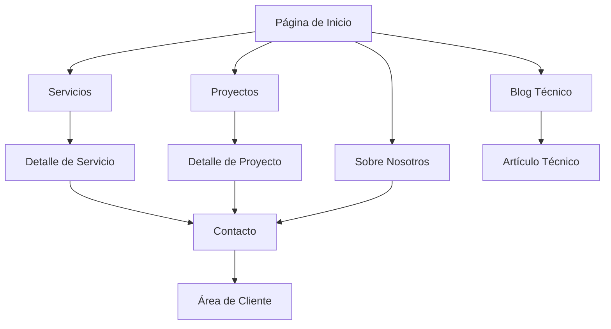

# Documento de Requerimientos del Producto - Topografía PECVA

## 1. Descripción General del Producto

Transformación completa del proyecto TecnoCrypter en una plataforma web profesional para servicios de topografía y estudios de terreno. La nueva web ofrecerá información detallada sobre servicios topográficos, proyectos realizados, y recursos técnicos especializados en mediciones, cartografía y estudios de suelo.

- **Objetivo principal**: Crear una presencia digital profesional para empresa de topografía que genere confianza y atraiga clientes potenciales.
- **Público objetivo**: Constructoras, arquitectos, ingenieros civiles, desarrolladores inmobiliarios y particulares que requieren servicios topográficos.
- **Valor de mercado**: Posicionamiento como referente en servicios topográficos profesionales con tecnología avanzada.

## 2. Características Principales

### 2.1 Roles de Usuario

| Rol | Método de Registro | Permisos Principales |
|-----|-------------------|---------------------|
| Visitante | Acceso directo | Navegar contenido público, solicitar cotizaciones |
| Cliente Registrado | Formulario de contacto/email | Acceso a área de proyectos, descargas de informes |
| Administrador | Acceso backend | Gestión completa de contenido, proyectos y blog |

### 2.2 Módulo de Características

Nuestra plataforma de topografía consta de las siguientes páginas principales:

1. **Página de Inicio**: sección hero con servicios destacados, navegación principal, testimonios de clientes.
2. **Servicios**: catálogo completo de servicios topográficos, mediciones especializadas, estudios de suelo.
3. **Proyectos**: galería de proyectos realizados, casos de estudio, antes y después.
4. **Sobre Nosotros**: historia de la empresa, equipo profesional, certificaciones y experiencia.
5. **Blog Técnico**: artículos especializados en topografía, normativas, tecnología de medición.
6. **Contacto**: formulario de contacto, información de ubicación, solicitud de cotizaciones.
7. **Área de Cliente**: acceso a informes de proyectos, seguimiento de trabajos en curso.

### 2.3 Detalles de Páginas

| Nombre de Página | Nombre del Módulo | Descripción de Características |
|------------------|-------------------|--------------------------------|
| Página de Inicio | Sección Hero | Mostrar servicios principales con llamadas a la acción, slider de proyectos destacados |
| Página de Inicio | Servicios Destacados | Presentar los 4 servicios más demandados con iconografía profesional |
| Página de Inicio | Testimonios | Mostrar reseñas de clientes con proyectos reales y calificaciones |
| Servicios | Catálogo de Servicios | Listar todos los servicios: topografía, batimetría, fotogrametría, replanteos |
| Servicios | Detalles de Servicio | Descripción técnica, proceso de trabajo, equipos utilizados, tiempos de entrega |
| Proyectos | Galería de Proyectos | Mostrar proyectos con imágenes antes/después, datos técnicos, ubicación |
| Proyectos | Filtros de Proyecto | Filtrar por tipo de proyecto, ubicación, año, sector (residencial, comercial, industrial) |
| Sobre Nosotros | Historia Empresa | Narrar trayectoria, hitos importantes, crecimiento y evolución |
| Sobre Nosotros | Equipo Profesional | Presentar topógrafos, ingenieros, certificaciones profesionales |
| Blog Técnico | Lista de Artículos | Mostrar artículos técnicos, normativas, casos de estudio, tendencias del sector |
| Blog Técnico | Detalle de Artículo | Contenido técnico completo, imágenes, diagramas, recursos descargables |
| Contacto | Formulario Contacto | Capturar datos del cliente, tipo de proyecto, ubicación, urgencia |
| Contacto | Información Empresa | Mostrar dirección, teléfonos, horarios, mapa de ubicación |
| Área Cliente | Dashboard Cliente | Mostrar estado de proyectos, informes disponibles, próximas citas |
| Área Cliente | Descarga Informes | Acceso a informes técnicos, planos, certificados en PDF |

## 3. Proceso Principal

**Flujo del Cliente Potencial:**
1. El visitante llega a la página de inicio y explora los servicios destacados
2. Navega a la sección de servicios para conocer detalles técnicos
3. Revisa proyectos similares en la galería para evaluar calidad
4. Lee sobre la empresa y equipo profesional para generar confianza
5. Solicita cotización a través del formulario de contacto
6. Recibe seguimiento personalizado y propuesta técnica
7. Una vez contratado, accede al área de cliente para seguimiento

**Flujo del Cliente Existente:**
1. Accede directamente al área de cliente con sus credenciales
2. Revisa el estado actual de sus proyectos en curso
3. Descarga informes y documentos técnicos completados
4. Solicita servicios adicionales o nuevos proyectos

## 4. Diseño de Interfaz de Usuario

### 4.1 Estilo de Diseño

- **Colores primarios**: #0274be (azul corporativo) para textos principales y elementos de navegación
- **Colores secundarios**: #3aab3e (verde) para botones de acción, destacados y elementos interactivos
- **Estilo de botones**: Botones redondeados con efecto hover, sombras sutiles para profundidad
- **Tipografía**: Fuentes sans-serif profesionales, tamaños 16px para texto base, 24px para títulos de sección
- **Estilo de layout**: Diseño limpio y profesional, uso de tarjetas para organizar información, navegación superior fija
- **Iconografía**: Iconos técnicos relacionados con topografía, instrumentos de medición, mapas y planos

### 4.2 Resumen de Diseño de Páginas

| Nombre de Página | Nombre del Módulo | Elementos de UI |
|------------------|-------------------|----------------|
| Página de Inicio | Sección Hero | Fondo con imagen de topógrafo en campo, overlay azul (#0274be) con 70% opacidad, botón CTA verde (#3aab3e) |
| Página de Inicio | Servicios Destacados | Grid de 4 columnas, tarjetas blancas con sombra, iconos azules, texto descriptivo en gris oscuro |
| Servicios | Lista de Servicios | Layout de lista con imágenes a la izquierda, títulos en azul (#0274be), botones "Ver más" en verde |
| Proyectos | Galería | Grid responsivo de imágenes, overlay con información del proyecto, filtros superiores con chips |
| Sobre Nosotros | Equipo | Tarjetas de perfil con fotos circulares, nombres en azul, cargos en gris, fondo blanco |
| Blog Técnico | Lista Artículos | Layout de blog con imagen destacada, fecha en verde, título en azul, extracto en gris |
| Contacto | Formulario | Campos con bordes azules al focus, botón de envío verde, mapa integrado con marcador personalizado |

### 4.3 Responsividad

Diseño mobile-first con adaptación completa para tablets y desktop. Navegación colapsible en móviles, grids que se adaptan de 4 columnas en desktop a 1 columna en móvil. Optimización táctil para formularios y botones de acción.